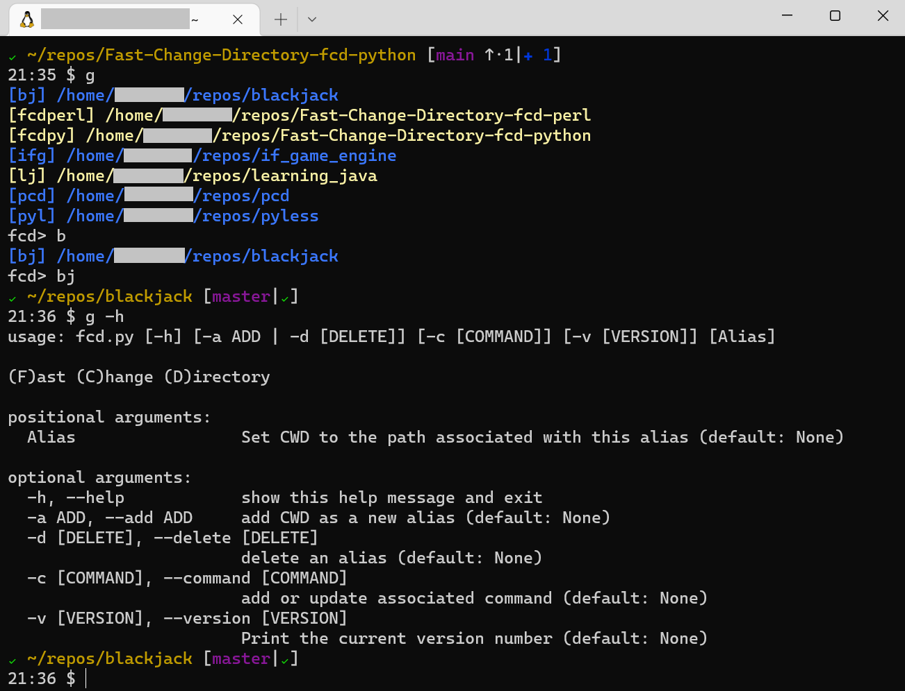

# fcd [](https://opensource.org/licenses/MIT)
(F)ast (C)hange (D)irectory for bash shells avoiding a lot of aliases.

## Summary
I'm a lazy person by nature. If I have to repeat a task multiple times I
immediately starts to think how I can automate this boring task. One of these
tasks are when you work in a bash shell and starts to change directory to
frequently used directories. You start to type the same **cd** commands
over and over again, normally followed by an **ls, ls -la or ll** command,
right? These commands are repeated a lot during a normal working day.

After a while you create an alias for these and drops them into your
`~/.bashrc` or `~/.bash_aliases` files and when its done the list of aliases
will continuously grow and never get cleaned up.

So, are you tired of adding aliases for frequently visited directories?
Tired of searching through your aliases or other configuration file to find
out how you named that smart shortcut?

**fcd** is a solution for that. The benefit of **fcd** is to replace tedious
aliases which are cumbersome to create, update and delete when you would like
to create shortcuts to frequent visited directories.

**fcd** behaves similar to a `cd <path>` alias and it will also support adding
extra commands after the change directory have taken place to be able to tailor
the behavior. If you have forgotten the shortcut name you created for a
specific alias the script supports a listing function of all created aliases,
it even have tab completion support.

## Installation and setup

### You have two options:

***Option 1:*** Run the provided `install.sh` script which will create needed bin
directory in the users home if it doesn't exists, copying all needed files to
the bin, updating the `$PATH` environment if needed and finally creating some
supporting shortcut aliases. Logout & login and you are ready to go.

***Option 2:*** Do it manually and this is just a proposal of setup and you can
of course tailor it according to your own preferences.

1) If you don't have a bin directory in your `$HOME` directory, create one:
`mkdir ~/bin`

2) Check if `~/bin` is included in your `$PATH` environment:
`echo $PATH`

3) If it's not, include the path to ~/bin into your `$PATH` environment. It
might vary which configuration file you have to update dependent on your
linux distribution and setup. When bash is invoked as an interactive login
shell, or as a non-interactive shell with the `--login` option, it first reads
and executes commands from the file `/etc/profile`, if that file exists.
After reading that file, it looks for `~/.bash_profile`, `~/.bash_login`, and
`~/.profile` in that order. Example: `PATH="$HOME/bin:$PATH"`

4) Copy fcd.py, fcd.sh, README.md and LICENSE to your ~/bin directory.

5) The scripts needs to be executable and if needed change the execution flags
`chmod u+x ~/bin/fcd.*`

6) Create a few new aliases to make the use of the **fcd** script more
efficient. Update or create the file ~/.bash_alias in your home directory and
open it with your favorite editor and add the following lines:
```bash
alias ++='fcd.py -a "$@"'
alias g='source ~/bin/fcd.sh "$@"'
```
> **_NOTE:_** Why g as an alias? Simple, g for (g)oto ;)

Done, logout and login again to make sure all path's and aliases are set
correctly.

### Ready to peek and poke around

A simple screenshot:



*Examples:*
```bash
$ ++ alias     To add current dir to my list with an associated alias.
$ g alias      To change directory to a entry based on the alias or parts of
               an alias.
$ g            You will be presented with a list of all entries you have saved
               and you could select one from the list based on the alias name.
               Tab completion supported.
```
If you want to add an extra command after the script have changed directory
for you. For example you might want to have a **`ls - la`** of the directory
this can be done with the command:
```bash
$ g -c <command>
or
$ g -c
# And you will be prompted to add the command interactively
```

For more information type:
`g -h` or `g --help`

Hope you will enjoy using **fcd** and it will save some precious time for you.

### Other projects at github I found addressing the same use case

<https://github.com/Gyumeijie/dirx>
<https://github.com/inwtx/Linux-change-directory-script>
