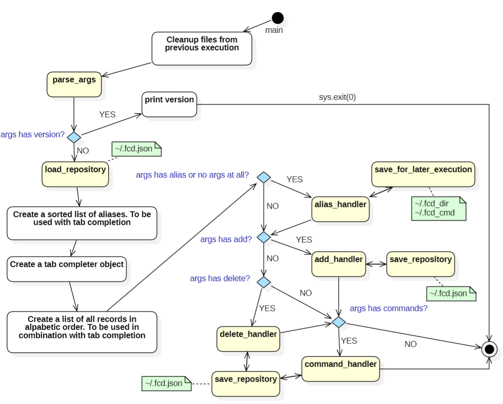

# Implementation Documentation

## Abstract

This is a simple implementation description of the code, just as a quick
recap to myself when I haven't touched this project for some months ;)

## A flowchart describing the main flow of execution.



## parse_args

Creates a Python "argparse" construct with all valid arguments which can be
provided from the command line. The commands `--add` and `--delete` are
mutually exclusive, meaning only one of them can be present as argument on the
command line when the program is called. `--add` requires a mandatory second
value (representing the alias), for all other arguments additional values are
optional.

Returns a dictionary with the values of all arguments. Dependent if they are
mandatory or optional they can have a value of `None`, `True` or a string
value.

This is a good source for argparse:
https://docs.python.org/3/library/argparse.html

## load_repository

This function will load the repository into a python dictionary from the
JSON formatted repository file `~/.fcd.json`

This is an example of the format of this file:

```json
{
  "fcd": {
    "directory": "/home/etorhed/repos/fcd",
    "command": ""
  },
  "dl": {
    "directory": "/mnt/c/Users/etorhed/Downloads",
    "command": "ll"
  }
}
```

Resulting in a repository dictionary, (nested dicts), looking like this:
```python
{'fcd': {'directory': '/home/etorhed/repos/fcd', 'command': ''},
'dl': {'directory': '/mnt/c/Users/etorhed/Downloads', 'command': 'll'}}
```

## alias_handler
When no argument or an alias is provided at command line this function is
called. The alias provided at command line doesn't have to be complete, it
can be just the beginning of an alias and with TAB completion the rest can
easily be filled in by the function. It will loop until a valid alias is
found in the repository or you abort the program with Ctrl-C.

When an alias is found alias_handler will call `save_for_later_execution`.
See next function description below and finally return back to main.

## save_for_later_execution

Will create a file, `~/.fcd_dir` inserting the directory path associated
with the alias. As an example if we refer to the repository example above and
the alias **dl** is provided the content of the file would be:

```text
/mnt/c/Users/etorhed/Downloads
```

In this example it will also create a file, `~/.fcd_cmd` for the associated
command `ll` as this is not empty and the content would be:

```text
ll
```

Finally returns back to `alias_handler`

> **_NOTE:_** If any of these two files exists after execution, and this
> program `fcd.py` is called from the external bash script `fcd.sh`, they
> will be sourced and change the directory in the parent shell and execute
> the command *(if provided)*.

## add_handler

If `-a <alias>` or `--add <alias>` is provided on the command line this
function will be called. If the alias is omitted on command line this
will be caught by `parse_args` as add requires a mandatory additional
field, and program will exit with an error message.

This function will just do a simple check that the alias is not already
present in the repository, if not it will take the **current working
directory (cwd)** and add it to the repository as a new dictionary record,
An example of a record dict looks like this:

```
{'directory': '/mnt/c/Users/etorhed/Downloads', 'command': ''}
```

Saves it to file as described in `save_repository` below and finally
return back to main.

> **_NOTE:_** There is no check if the current directory already
> exists associated with another alias, that is completely ok and
> possibly even wanted sometimes.

## save_repository

Saves the repository dictionary back out to the file `~/.fcd.json` in
json format.

## delete_handler

If `-d [alias]` or `--delete [alias]` where alias is optional, is
provided on the command line this function will be called.

If an exact match of an alias is provided the associated record will be
removed from the repository and saved to file as described in
`save_repository` above. If no or an incomplete alias, (not found in the
repository), is provided it will go into TAB completion mode until a
match is found in the repository or you abort the program with Ctrl-C.
If a match is found the associated record will be removed from the
repository and saved to file as described in `save_repository` above.
Finally returns back to main.

## command_handler

If `-c [cmd]` or `--command [cmd]` where cmd is optional, is provided on the
command line this function will be called.
It will first check if this comes after a call to `add_handler`, in that case
the exact alias is already provided and can be used. If not, the function will
ask you to provide the alias name on the record you would like to add or
update the command for. TAB completion will be supported to find the correct
record.

When a record is selected it will update it with the `cmd` provided on the
command line (if it is provided), else it will ask you to type in a command
to add. When this is done it will be saved to file as described in
`save_repository` above. Finally returns back to main.

